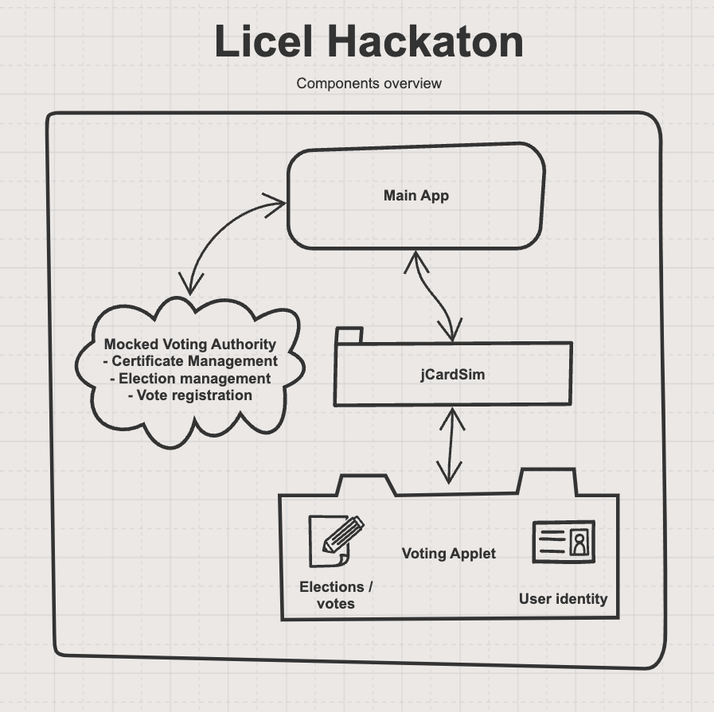

# Secure Voting app

The **Secure Voting App** is a submission for the **[Licel Droidcon Hackathon](https://github.com/licel/droidcon-hackathon)** and is a 
re-write of the original "HOTP Authenticator App" project.

This app demonstrates how the voting process can be securely managed using a trusted app. Elections, 
registered voters, and votes are overseen by a voting authority, which is simulated within this app. 
Upon installation, the voter sends a registration request to the voting authority in the form of a
double-signed CSR (Certificate Signing Request). 

The voting authority verifies that the CSR  originates from a trusted applet by validating the outer 
signature with the applet’s public key. Once verified, the authority issues a voter certificate back 
to the app. The applet, in turn, confirms the certificate’s authenticity using the voting 
authority’s public key.

After onboarding, the voter can access elections distributed by the voting authority. The applet 
validates the authenticity of each election, ensuring a secure voting experience. The voter can cast 
their vote offline in a trusted manner. 

Once the vote is cast, it can be uploaded, verified, and registered with the voting authority. 
The authority re-signs the vote and returns it to the app, where the applet verifies its 
authenticity. The end user can review the receipt to confirm both its validity and that the correct 
vote has been recorded.

Demo Video: **[Demo](./media/demo-video.mov)**

## Overview

## Features
- **Java Card Simulation**: The Trusted Application is developed and tested using **jCardSim**.
- **CSR**: Implements basic CSR functionality in the applet as defined in rfc2986.
- **X509**: Implements basic X509 parsing and signature verification. 

## Key Components
- **jCardSim**: Simulates the Java Card runtime environment for easy development and testing of Java Card applets.
- **Trusted Application**: A secure Java Card applet implementing Voting Applet logic.
- **Android Application**: Provides a user-friendly interface for managing elections and votes.
- **Mocked backend**: The app mocks the backend functionality of the voting authority. 

## Getting Started
### Database 
The keys and certificates are provided in cert-db.xdb that can be accessed with the XCA tool https://www.hohnstaedt.de/xca/

Password: `Secret123`

### Prerequisites
- **Android Studio**: Required for building and running the mobile application.
- **jCardSim Library**: Included in the project dependencies.

## Secure Voting app APDU commands

### 0. Sending data larger than a short APDU

The applet has an internal buffer of 1024 bytes where it can copy data for 
processing. To send more data than fits an short APDU the applet uses the P1
parameter to indicate if there is more data coming from the host. 

| P1     | Value | Definition                                                                  |
|--------|-------|-----------------------------------------------------------------------------|
| INIT   | 01    | Send the first chunk of data to the card                                    |
| UPDATE | 02    | Send next chunk of data to the card (can be called multiple times)          |
| FINAL  | 03    | Send final chunk of data to the card and begin processing all received data |

### 0. Receiving data larger than a short APDU

Some commands returning data from the card may return more data than fits in 
a short APDU. The applet uses the status word 61XX to indicate that the command
was successful but that there is more data to fetch from the card. The client can 
fetch the remaining data from the applet with the standard GET_RESPONSE call. 
Note that the applet does not need to fill each rAPDU data to the max size of a 
short APDU for later parsing. Instead it returns data in a context specific fashion.
As an example a signed blob of data can be returned with one or more 61XX. The data
returned in the last call to GET_RESPONSE returning 9000 will be the signature of 
the blob of data and not part of the data itself. 

### 1. Applet INS

#### 1.1 Create CSR (INS_CSR_CREATE)

| Field | Value | Definition        |
|-------|-------|-------------------|
| CLA   | 00    |                   |
| INS   | 10    | Create CSR        |
| P1    | VAR   | Offset to PIN     |
| P2    | 00    |                   |
| Lc    | VAR   |                   |
| Data  |       | Common Name + PIN |
| Le    | VAR   |                   |

##### Description

Generate a new (EC) key pair and create a CSR with the provided common 
name. The CSR is signed with the newly generated private key. The signed
CSR is double signed with an applet specific private key. The corresponding
public key is available for the voter authority and ca be used to verify 
the trusted origin of the CSR (and safekeeping of the private key). The 
outer signature is returned as response data. The status word for this
operation is a 61XX where XX indicates the size of the CSR data that can 
be fetched with a GET_RESPONSE command. 

##### Response

| Field  | Value | Definition          |
|--------|-------|---------------------|
| Data   |       | CSR outer signature |

##### Response codes

| SW1 | SW2 | Description                                   |
|-----|-----|-----------------------------------------------|
| 61  | XX  | OK - CSR data remaining to be fetched         |
| 6A  | 00  | Illegal state. Can not be called at this time |
| 67  | 00  | PIN length is invalid                         |

#### 1.2 Fulfill CSR (INS_CSR_FULFILL)

| Field | Value | Definition        |
|-------|-------|-------------------|
| CLA   | 00    |                   |
| INS   | 20    | Fulfill CSR       |
| P1    | VAR   | INIT/UPDATE/FINAL |
| P2    | 00    |                   |
| Lc    | VAR   |                   |
| Data  |       | CSR               |
| Le    | 0     |                   |

##### Description

Receives the X509 certificate from the CSR. Verifies that the data in
the certificate matches the data from the CSR. It also verifies that the
certificate was issued/signed by the proper authority by verifying the 
signature with the issuer public key stored in the applet code. Once the
certificate is successfully verified it is stored and the applet is now
ready to receive elections and cast votes. 

##### Response

| Field  | Value | Definition          |
|--------|-------|---------------------|
| Data   |       | CSR outer signature |

##### Response codes

| SW1 | SW2 | Description                                   |
|-----|-----|-----------------------------------------------|
| 90  | 00  | OK                                            |
| 6A  | 00  | Illegal state. Can not be called at this time |
| 69  | 82  | Cert does not match the CSR data              |
| 6A  | 01  | Invalid signature                             |
| 6A  | 84  | Incorrect P1/P2 parameters                    |    

#### 1.3 Update PIN (INS_UPDATE_PIN)

| Field | Value        | Definition                        |
|-------|--------------|-----------------------------------|
| CLA   | 00           |                                   |
| INS   | 60           | Update PIN                        |
| P1    | 00           |                                   |
| P2    | 00           |                                   |
| Lc    | Variable     | Length of PIN input               |
| Data  | New PIN data |                                   |
| Le    | None         |                                   |

##### Description

This command allows the user to update their PIN if the current PIN is 
validated. It verifies the length of the new PIN and checks whether the 
current PIN has been validated before allowing the update.

##### Error Codes

| SW1 | SW2 | Description                                   |
|-----|-----|-----------------------------------------------|
| 90  | 00  | OK                                            |
| 6A  | 00  | Illegal state. Can not be called at this time |
| 67  | 00  | Wrong length                                  |
| 69  | 82  | PIN must be validated before it can be change |

#### 1.4 Verify PIN (INS_VERIFY_PIN)

| Field | Value                   | Definition          |
|-------|-------------------------|---------------------|
| CLA   | 00                      |                     |
| INS   | 61                      | Verify PIN          |
| P1    | 00                      |                     |
| P2    | 00                      |                     |
| Lc    | Variable                | Length of PIN input |
| Data  | PIN data to be verified |                     |
| Le    | None                    |                     |

##### Description

This command verifies the provided PIN against the stored PIN. If the PIN is 
incorrect, the system responds with the remaining attempts before blocking 
further attempts. If the PIN is correct, it allows access to further operations.
SW2 always return the number of remaining attempts. 

##### Error Codes

| SW1 | SW2 | Description                                   |
|-----|-----|-----------------------------------------------|
| 90  | XX  | OK - PIN verified successfully                |
| 63  | XX  | Incorrect PIN                |
| 6A  | 00  | Illegal state. Can not be called at this time |

#### 1.5 Get Status (INS_GET_STATUS)

| Field | Value | Definition                      |
|-------|-------|---------------------------------|
| CLA   | 00    |                                 |
| INS   | 70    | Get the status of the applet    |
| P1    | 00    |                                 |
| P2    | 00    |                                 |
| Lc    | 00    | No data input                   |
| Data  | None  | No data input                   |
| Le    | 1     | 1 byte output indicating status |

##### Description

This command retrieves the status of the applet, specifically whether a 
client certificate is present or not.

##### Response

| Field  | Value  | Definition                                    |
|--------|--------|-----------------------------------------------|
| Data   | 0x00   | No certificate stored                         |
| Data   | 0x01   | A certificate is stored                       |

##### Error Codes

| SW1 | SW2 | Description                              |
|-----|-----|------------------------------------------|
| 90  | 00  | OK                                       |
| 6A  | 00  | Illegal state. Can not be called at this time |

#### 1.6 Get Certificate (INS_GET_CERTIFICATE)

| Field | Value | Definition                        |
|-------|-------|-----------------------------------|
| CLA   | 00    |                                   |
| INS   | 71    | Get Certificate                   |
| P1    | 00    |                                   |
| P2    | 00    |                                   |
| Lc    | None  |                                   |
| Data  | None  |                                   |
| Le    | None  |                                   |

#### Description

This command retrieves a certificate, typically for the voter. Since the certificate 
may exceed the maximum allowed data size for an APDU the data is sent in chunks. The 
first chunk is sent in the initial response, and the remaining data is buffered for
further retrieval in subsequent calls.

##### Error Codes

| SW1 | SW2 | Description                                                      |
|-----|-----|------------------------------------------------------------------|
| 61  | XX  | More data remaining, where `XX` is the number of bytes remaining |
| 6A  | 00  | Illegal state. Can not be called at this time |

#### 1.7 Get Election (INS_GET_ELECTION)

| Field | Value       | Definition                        |
|-------|-------------|-----------------------------------|
| CLA   | 00          |                                   |
| INS   | 72          | Get election details              |
| P1    | 00          |                                   |
| P2    | 00          |                                   |
| Lc    | 04          | Election ID input                 |
| Data  | Election ID |                                   |
| Le    | Variable    | Election data output              |

##### Description

This command retrieves the details of an election based on the provided id.

##### Response

| Field | Description                                                      |
|-------|------------------------------------------------------------------|
| Election ID | 4 bytes representing the election ID                       |
| Title | The title of the election as 20 bytes                            |
| Expiration | 8 bytes representing the expiration timestamp                    |
| Number of options | 1 byte indicating the number of available options/candidates     |
| Candidate option sizes | Each option's candidate length encoded as two bytes              |
| Candidate options | Candidates, ach up to the length indicated by the candidate size |

##### Error Codes

| SW1 | SW2 | Description                                   |
|-----|-----|-----------------------------------------------|
| 90  | 00  | OK                                            |
| 6A  | 02  | Election not found                            |
| 6A  | 00  | Illegal state. Can not be called at this time |

#### 1.8 Get Elections (INS_GET_ELECTIONS)

| Field | Value | Definition                        |
|-------|-------|-----------------------------------|
| CLA   | 00    |                                   |
| INS   | 73    | Get Elections                      |
| P1    | 00    |                                   |
| P2    | 00    |                                   |
| Lc    | None  |                                   |
| Data  | None  |                                   |
| Le    | None  |                                   |

##### Description

This command retrieves a list of active elections from the applet. 
Each active election's ID is copied to the APDU buffer, and the count 
of active elections is placed in the first byte of the response. 
The applet can support multiple elections, but only active elections 
will be included in the response.

##### Error Codes

| SW1 | SW2 | Description                                   |
|-----|-----|-----------------------------------------------|
| 90  | 00  | OK - Elections successfully retrieved         |
| 6A  | 00  | Illegal state. Can not be called at this time |

#### 1.9 Register Election (INS_REGISTER_ELECTION)

| Field | Value | Definition           |
|-------|-------|----------------------|
| CLA   | 00    |                      |
| INS   | 76    | Register Election    |
| P1    | VAR   | INIT/UPDATE/FINAL    |
| P2    | 00    |                      |
| Lc    | VAR   |                      |
| Data  |       | Signed Election Data |
| Le    | 0     |                      |

##### Description

Receives signed election data in chunks. The applet verifies the 
authenticity of the data by checking the provided signature with t
he intermediate public key. Once the signature is verified, the 
parsed election details are stored. 

##### Response

| Field  | Value | Definition               |
|--------|-------|--------------------------|
| Data   |       | Empty response on success |

##### Response codes

| SW1 | SW2 | Description                                   |
|-----|-----|-----------------------------------------------|
| 90  | 00  | OK                                            |
| 6A  | 84  | Insufficient space to register a new election |
| 67  | 00  | Invalid data length                           |
| 6A  | 01  | Invalid signature                             |
| 6B  | 00  | Incorrect P1/P2 values                        |
| 6A  | 00  | Illegal state. Can not be called at this time |

#### 1.10 Cast Vote (INS_VOTE)

| Field | Value | Definition                               |
|-------|-------|------------------------------------------|
| CLA   | 00    |                                          |
| INS   | 77    | Cast Vote                                |
| P1    | VAR   | PIN offset in data payload               |
| P2    | VAR   | PIN size in data payload                 |
| Lc    | VAR   |                                          |
| Data  |       | Election ID, Timestamp, Vote Option, PIN |
| Le    | 0     |                                          |

##### Description

Allows the user to cast a vote for a registered election. Sends the 
signature in the response and indicates the remaining data can be 
retrieved with `GET RESPONSE`.

##### Response

| Field  | Value       | Definition                        |
|--------|-------------|-----------------------------------|
| Data   | ECDSA-SHA256 signature | Signature of the voting payload   |

##### Response codes

| SW1 | SW2 | Description                                         |
|-----|-----|-----------------------------------------------------|
| 90  | 00  | OK                                                  |
| 6A  | 83  | Election not found                                  |
| 6A  | 85  | Vote option not found                               |
| 63  | CX  | PIN validation failed (`X` is remaining attempts)   |
| 62  | XX  | Indicates remaining bytes in the response           |
| 6A  | 00  | Illegal state. Can not be called at this time |

#### 1.11 Get Vote Receipt (INS_GET_VOTE_RECEIPT)

| Field | Value | Definition             |
|-------|-------|------------------------|
| CLA   | 00    |                        |
| INS   | 78    | Get Vote Receipt       |
| P1    | 00    |                        |
| P2    | 00    |                        |
| Lc    | 04    | Length of Election ID  |
| Data  |       | Election ID            |
| Le    | 0     |                        |

##### Description
Returns the signature in the response, with the remaining data 
available via `GET RESPONSE`.

##### Response

| Field  | Value          | Definition                                                        |
|--------|----------------|-------------------------------------------------------------------|
| Data   | Signature + Status Byte | Signature of the voting payload with a submitted status indicator |

##### Response codes

| SW1 | SW2 | Description                                    |
|-----|-----|------------------------------------------------|
| 90  | 00  | OK                                             |
| 6A  | 02  | Election not found                             |
| 6A  | 05  | Vote not yet cast                              |
| 62  | XX  | Indicates remaining bytes in the response      |
| 6A  | 00  | Illegal state. Can not be called at this time  |

#### 1.12 Register Submission (INS_REGISTER_SUBMISSION)

| Field | Value | Definition                               |
|-------|-------|------------------------------------------|
| CLA   | 00    |                                          |
| INS   | 79    | Register Submission                      |
| P1    | VAR   | INIT/UPDATE/FINAL                        |
| P2    | 00    |                                          |
| Lc    | VAR   | Signed submission data                   |
| Data  |       | Election ID, candidate option, timestamp |
| Le    | 0     |                                          |

##### Description

Registers the submission of a previously cast vote. The submission is 
signed by the voting authority and functions as a receipt that the laid
vote has been registered in the voting system. 
##### Response

| Field  | Value | Definition                         |
|--------|-------|------------------------------------|
| Data   | None  | No additional response data        |

##### Response codes

| SW1 | SW2 | Description                                    |
|-----|-----|------------------------------------------------|
| 90  | 00  | OK                                             |
| 6A  | 01  | Invalid signature                              |
| 6A  | 02  | Election not found                             |
| 6A  | 03  | Election integrity failed (timestamp mismatch) |
| 6A  | 81  | Invalid or incorrectly formatted data          |
| 6A  | 00  | Illegal state. Can not be called at this time  |

